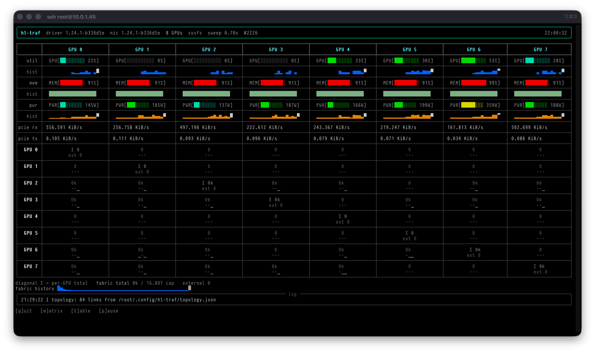

# hl-traf

Live NIC fabric traffic monitor for Habana Gaudi (HL-225 / Gaudi2) systems.
Polls all GPUs in parallel via `libhlml.so` (ctypes) and renders per-port
and per-GPU-pair bandwidth in a rich TUI.



## Requirements

- SynapseAI / habanalabs driver stack providing `/usr/lib/habanalabs/libhlml.so`
- Python 3.11+ with `rich` and `typer` (see setup below)

## Setup

```sh
uv venv .venv
uv pip install -p .venv/bin/python rich typer
```

Run via the launcher (works from any directory):

```sh
./hl-traf --help
```

## Commands

| Command | Purpose |
|---|---|
| `hl-traf` / `hl-traf watch` | Live monitor. Default view is the 8×8 GPU-pair **matrix**; `--view table` shows one row per port. |
| `hl-traf discover` | Infer the internal NIC wiring from traffic correlation and cache it. Needs an HCCL collective running while it samples. |
| `hl-traf qual-map` | Decode the static NIC wiring tables shipped with the qual stack (no traffic needed). `--save` writes the cache. |
| `hl-traf ports` | One-shot map of ports, type (internal/external), link state, peers and netdevs. |
| `hl-traf selftest` | Validate the correlation matcher on synthetic counter traces. |

The matrix view carries a status strip under the header: per-GPU AIP
utilization (`GPU[... %]` + history sparkline), HBM usage
(`MEM[... %]` + history), and left-justified `pcie rx` / `pcie tx` rows
(`0.000 KiB/s`), all read every sweep. The PCIe
rates come from the driver's `HL_INFO_PCI_COUNTERS` ioctl on
`/dev/accel/accel_controlD<minor>` (instantaneous bytes/sec), issued as one
parallel wave with fds kept open — ~30 ms for all 8 GPUs; note libhlml's
`hlml_device_get_pcie_throughput` wrapper is both slower (opens the device
per call) and truncates the u64 counters to 32 bits, so hl-traf talks to
the ioctl directly. All rows shrink to fit narrow terminals. Meters and
values use the delta green/red color coding described below.

### Watch keys

`q` quit · `m` matrix view · `t` table view · `p` pause polling

### Useful options

- `--interval/-i` minimum seconds between sweeps (fast path sweeps in ~0.3–0.5 s)
- `--ports all|internal|external`
- `--line-rate` NIC line rate in Gb/s for utilization bars (default 100)
- `--history` sparkline length in sweeps (default 60)
- `--once` render a single primed snapshot and exit (good for logs/scripts)
- `--log-file` mirror the log panel to a file; `-v` for debug logging

## How it works

Each NIC counter read is a ~100 ms firmware query, whether it comes from
`hlml_nic_get_statistics` or from the driver's IB sysfs
(`/sys/class/infiniband/hbl_<n>/ports/<p+1>/hw_counters/<name>` — same
numbers, verified byte-identical). The firmware, however, serves queries
concurrently: all 24 ports of one GPU in parallel finish in ~110 ms, and
all **192 ports of the system (8 GPUs × 24) in one parallel wave of ~0.2 s**.

hl-traf's default backend (`sysfs`) therefore reads every polled port in a
single parallel wave per sweep: rx/tx octets for all ports, with full
rate+error counter sets rotated across GPUs (one GPU per sweep, plus a
whole-system pass every `errors_every` sweeps) so sweeps stay smooth at
~0.3–0.5 s end to end (~2–3 Hz refresh). When the sysfs tree is absent it
falls back to `libhlml.so` calls — serial per GPU, parallel across GPUs —
which costs ~2.7 s per full sweep. The header shows the active backend
(`sysfs`/`hlml`) and measured sweep time.

Rates are deltas of the cumulative `rx_Octets`/`tx_Octets` counters,
smoothed with an EWMA and kept in sparkline ring buffers. A failed read
marks only that port stale — it never kills the sweep.

### Counter-read defect guard

The NIC firmware on this stack occasionally serves a counter read that is
offset by an exact multiple of 2**32 units (observed: ±13 × 2**32 bytes ≈
±55.8 GB on rx/tx octets, ~10% of reads, on idle ports, both backends,
sequential and parallel reads alike). A naive delta turns one such read
into phantom traffic of tens of TB/s across the fabric.

hl-traf screens every rate delta against the NIC line rate (`--line-rate`):
a positive delta above what line rate can move in one window, or any delta
with the exact-2**32-multiple signature, is dropped — the port keeps its
previous baseline and reports 0 for that window. Real traffic is always
below the cap and passes untouched. Rejected reads are counted per port
(`torn_reads`) and logged with `-v`.

External ports (8, 22, 23 on this baseboard) also exist as Linux netdevs
named `enp<pci-bus>s0d<port>`; the `ports` command shows that mapping.

## Fabric topology discovery

No Habana API exposes which internal NIC port wires to which peer:
`hlml` only reports port class (internal/external), link state and
counters; `hl-smi topo` is CPU/NUMA affinity; there are no sysfs/debugfs
wiring nodes and internal ports have no netdevs to run LLDP on.

hl-traf gets the wiring from two sources:

### 1. Static qual map (no traffic needed) — `hl-traf qual-map`

`/opt/habanalabs/qual/lib/libNICTests.so` ships hardcoded wiring tables
(`g_card_location_0..7_mapping`, used by the qual `NIC_Base_Test
-test_type pairs` flow). Each table holds 24 entries of `{route,
remote_port, remote_card}`: `route == 0xFF` means a direct internal
copper link; any other value is an external port reaching `remote_card`
through switch route N. hl-traf parses the ELF symbol table, decodes the
tables, and maps card locations to this system's GPUs through
`hlml_device_get_module_id()` (same module IDs as `hl-smi -Q module_id`).

On this HLS-2H box that yields: **84 direct links = 28 GPU pairs × 3
links**, plus 12 switched routes on the external ports (8/22/23). `watch`
and `ports` fall back to this map automatically when no cache file exists.

### 2. Traffic correlation (verifies/overrides) — `hl-traf discover`

On a point-to-point link, port A's `tx_Octets` delta equals the peer port's
`rx_Octets` delta within framing overhead. `discover` samples N windows
(default 60 × 5 s), scores every cross-GPU port pairing, and greedily
assigns matches, constrained to `--links-per-pair` (default 3 — this
baseboard wires 3 links between every GPU pair: 21 internal ports / 7
peers). The result is written to `~/.config/hl-traf/topology.json`:

```json
{
  "version": 1,
  "discovered_at": "2026-08-14T20:31:29+00:00",
  "method": "qual-libNICTests-static",
  "links": [
    {"gpu_a": 0, "port_a": 3, "gpu_b": 5, "port_b": 3, "score": 1.0}
  ],
  "routed_links": [
    {"gpu_a": 0, "port_a": 8, "gpu_b": 1, "port_b": 8, "route": 1}
  ]
}
```

The file is hand-editable; `watch` and `ports` load it on startup and show
peers once present. Links carrying no traffic during sampling cannot be
matched by correlation — but the static qual map covers them.

Example:

```sh
hl-traf qual-map --save          # instant, from the qual stack tables
# and/or, while an HCCL collective is running on all 8 GPUs:
hl-traf discover --windows 20 --interval 5 -y   # verifies with real traffic
hl-traf                         # matrix shows per-pair traffic on the wiring
```

## Layout

```
health_monitor/
  hlml.py       ctypes bindings for libhlml.so (+ module IDs)
  poller.py     async per-GPU polling engine, rates, sparklines
  topology.py   wiring cache, sampler, correlation matcher,
                qual libNICTests.so table decoder (pure-python ELF parse)
  log.py        rich log-panel handler
  ui/           format helpers, table view, matrix view, live app
  cli.py        typer commands: watch (default), discover, qual-map,
                ports, selftest
```

---

# Monitoring server

`hl-traf serve` runs an HTTP server that polls the card, records to
SQLite, and serves both a web UI and the TUI from one JSON API.

```sh
make serve                       # port 5678, ~/.hl-traf, no vLLM
hl-traf serve --port 5678 --vllm http://127.0.0.1:8000 --nic
make tui                         # or: hl-traf
```

Open `http://<host>:5678/` for the web UI. `hl-traf` with no arguments is
the TUI; it needs a running server and says so if there isn't one.

There is **no authentication** — anyone who can reach the port can change
profiles and settings. It binds `0.0.0.0` by default; use `--bind
127.0.0.1` if that is not what you want.

## Why one server

Only the server touches the hardware. This is not tidiness: the firmware
mailbox is globally serialised, so a second reader costs *everyone*
latency. Measured on this box:

| | 22 temperatures, x3 |
|---|---|
| one process | 236 ms |
| two processes, concurrently | 517 ms each |
| one process + an `hl-smi -q` loop | 535 ms |

So the TUI is a JSON client with no direct-device fallback, and running
`hl-traf watch`, `ports` or `discover` while the server is up will slow
its sweeps.

## Polling cost

Every hwmon channel is a ~3.6–6 ms firmware round trip, and threading
does **not** help — 8, 16, 32 and 63 workers all land at 190–220 ms,
because the driver serialises them.

```
1 sensor              6 ms        all 22 temperatures   80 ms
4 on-chip temps      23 ms        all 63 channels      190-285 ms
clk_cur_freq_mhz      4 ms        PCI link/status      0.05 ms  (free)
vLLM /metrics      6-11 ms  (64 KB, the whole document)
```

Two consequences shape the design:

* **The engine reads only what is needed** — the union of what the
  settings say to record and what any connected client is displaying.
  Nobody pays for the twenty ~817 mV core rails unless someone is looking
  at them. Subscribing to all 33 voltage channels moves a sweep from
  ~145 ms to ~240 ms; unsubscribing puts it back.
* **Recording everything is opt-in.** `Record exotic rails` roughly
  doubles the sweep (92 → 189 series, ~145 ms → ~600 ms at a 3 s
  interval). It is off by default. The series stay graphable live either
  way; the setting only controls what is written to disk.

## What is measurable

212 series on this box, in 25 groups. Highlights:

| Group | Source | Notes |
|---|---|---|
| Temps (22 channels) | hwmon | On Chip 0-3, HBM 0-5, On Chip TD 0-3, On Board x5, CPLD, VRM1, VRM2 |
| Peaks / Limits | hwmon | firmware high-water marks since boot, and per-sensor `_crit` |
| Power / Rails | hwmon + derived | 54V draw is `power1_input`; **12V is derived V x I** — no counter exists for it |
| Voltages (33) / Currents (7) | hwmon | only in19-22 and curr1-2 are identified; the rest are labelled honestly as unidentified |
| Energy | HLML | cumulative mJ; its rate is a true average watts, immune to sampling aliasing |
| Throttle | HLML | cumulative ns power-capped and thermally throttled; the rate is a duty cycle |
| Clocks | HLML | SOC only — MME/TPC/IC return `NOT_SUPPORTED` on this stack |
| PCIe | ioctl + sysfs | rates from `HL_INFO_PCI_COUNTERS`; link gen/width from sysfs (HLML's version is unsupported here) |
| vLLM (40) | `/metrics` | throughput, queue, cache, latency histograms, tokens/step |

Deliberately absent, because they do not work on this stack: fan speed
(`N/A` on this board), per-engine MME/TPC/IC clocks, HLML's VRM and CTEMP
sensor types, HLML's PCIe link geometry, persistence mode. HLML's
`get_temperature_threshold` does work but returns a uniform 90 for all
four types, which is useless next to hwmon's real per-sensor `_crit`
values (93/125/88/80/90), so it is not used.

The 22 temperature **labels** come from `hl-smi -q`'s ordering, not from
sysfs — hwmon ships no `*_label` files. The channel count is cross-checked
at startup and falls back to generic `temp1..temp22` names on any
mismatch, rather than mislabelling confidently.

### PCIe throughput

Read from the driver's `HL_INFO_PCI_COUNTERS` ioctl with the control fds
kept open. libhlml's `hlml_device_get_pcie_throughput` is not used: it
opens the device per call, and it truncates the driver's u64 counters to
32 bits.

The ioctl reports an **instantaneous** rate, and it is far burstier than
the engine's poll interval. Two readings 5 s apart on an otherwise idle
card measured 0 and 52,939 B/s. Sampling that once per sweep aliases
badly — a burst between two sweeps never happened as far as the graph is
concerned.

So a background thread samples every 0.5 s and each engine sweep drains
the accumulator, recording:

| series | meaning |
|---|---|
| `devN.pcie.tx` / `.rx` | **mean** over the interval |
| `devN.pcie.tx.peak` / `.rx.peak` | highest sub-sample in the interval |

The mean is a real average rather than a point-sample lottery, and the
peak catches the bursts the mean smooths away. The ioctl is cheap enough
that sub-sampling costs very little.

Note this differs from what `hl-traf watch` shows: the fabric poller
EMA-smooths its own 0.3–0.5 s samples for display, so its number will not
match these exactly.

### A failure mode to know about

A series whose `source` has no registered reader produces **no points at
all** — not nulls, nothing — which on a graph is indistinguishable from an
idle sensor. Two series shipped that way and were only found by auditing
the whole catalog rather than spot-checking: PCIe tx/rx (no `pcie` reader
was registered) and `vllm:num_preemptions_total` (declared a counter, but
the sweep passed only gauges to the vLLM reader).

The engine now logs an error the first time it meets a source it has no
reader for, naming the affected series. `scratchpad/t_audit.py`-style
checks — walk every core series and classify it as producing values,
all-null, or no-points — are the way to catch the rest.

## vLLM

Scraped from Prometheus at `/metrics` on the model server's own port. The
log file is **not** parsed, and there is no code to do so:

* `/metrics` updates at engine-step granularity, not on the 10-second
  logger tick. At 1 Hz you see generation throughput per second and the
  idle gaps between requests that the logged 10-second average smooths
  away entirely.
* It is timestamped by us, inside the same sweep that reads the sensors,
  so throughput and rail voltage share one clock. Correlating them is
  exact rather than ±5 s.
* It carries the latency histograms — TTFT, inter-token, e2e, queue,
  prefill, decode — which appear in no log line at any verbosity.

Two derived series are worth knowing about. `tokens/step` (from
`iteration_tokens_total`) reads **1.0 when no batching is happening** and
rises with concurrency — a direct read on batch efficiency. And the
prefix-cache hit rate is offered both **windowed** and **lifetime**: the
lifetime figure is nearly frozen (94.4% over 50M queried tokens here), so
the windowed one is the default.

Latency percentiles are differenced against a scrape from 60 s ago rather
than sweep-to-sweep, the way Prometheus' `rate()[1m]` does — histograms
only move when a request finishes, so a 1-second window is empty most of
the time.

If vLLM restarts its counters reset to zero; a counter that goes backwards
yields a gap, never a negative spike.

## Storage

Two databases under `--data-dir` (default `~/.hl-traf`), both WAL:

* **`profiles.db`** — graph profiles and engine settings. Every write goes
  through one lock, so several editors cannot corrupt it.
* **`samples.db`** — recorded samples, plus 1-minute and 1-hour rollups
  carrying **min/max/avg**, not just avg: averaging away a thermal spike
  defeats the point of looking.

Each samples database carries **its own copy of the series catalog**, and
reads resolve by series *key*, never by integer id. Without that, an
archive's `series_id 47` could mean a different sensor than the live
database's 47 and switching databases would plot the wrong line under the
right label.

Roughly 1.5 GB/month at the 5 s default; ~19 GB/month with everything
recorded at 1 Hz. Recording stops when free space on the database's own
filesystem falls below `--min-free` (2 GiB default) and both UIs show
`RECORDING STOPPED — DISK FULL`. Note this box has `/` at 93% while
`/home` has hundreds of gigabytes free, which is why the check stats the
database's filesystem rather than `/`.

### Rotation, archives and replay

```sh
hl-traf serve-reset              # rotate samples.db aside, start fresh
hl-traf serve-list               # list databases with their time extents
```

Nothing is ever deleted automatically, and there is no delete button:
archives are multi-gigabyte and unrecoverable, so removing them is a
command-line job.

A **source** is an ordered list of databases plus a time shift. That one
idea covers three features:

```
live          = [samples.db],                     shift 0
stitched      = [archive2, archive1, samples.db], shift 0
overlay       = two or more sources on one graph, each with its own shift
```

Stitching renders several archives as one timeline; gaps are drawn as
gaps and never bridged, because rotation is not instantaneous and the
server may have been down in between. Overlapping selections are refused
rather than double-plotted. SQLite's 10-database `ATTACH` limit is not
relied on — databases are queried serially and merged, so twenty archives
still work.

Database choice is **per client**: one person can study Tuesday's archive
while another watches live, and recording never stops either way.

`--replay PATH` is a different thing, for a different job: it opens no
device handles at all and records nothing, so you can review an archive
copied to a machine with no Gaudi in it.

## Concurrent editing

Profiles carry a version. A save quoting a stale version is refused with
HTTP 409 and the UI says *"X was updated by someone else — can't change"*.
Saves are also pushed over SSE, so the second editor normally sees the
change as it lands and the refusal is a backstop rather than the common
case.

Deleting a graph or a profile removes **graph settings only**. No
recorded sample data is ever touched.

## Graphs

Series sharing a base unit share a Y axis and a colour family — "Temps /
HBM" lands as six shades of one hue on one °C axis. Mixing units grows a
second, third or fourth axis in its own hue, with the lines taking that
hue so you can tell which axis a line is read against. Four axes is the
hard cap; past that nothing is legible, and the UI refuses the fifth
rather than rendering mush.

**ADD** picks individual series; **ADD GROUP** opens a group with
everything pre-selected so you unselect what you don't want, then confirm.

A graph's *redraw* rate is per-graph (web: the dropdown in its header;
TUI: same). The *sample* rate is an engine setting and applies to
everyone — the two are deliberately separate.

### Mouse and keyboard on the graphs

| gesture | effect |
|---|---|
| drag across a graph | zooms to that span; a translucent box tracks the drag with `from → to (duration)` shown live |
| hover | crosshairs extend across **every** graph on the page, so a point in one lines up with the same instant in the others |
| **hold ctrl** (or cmd) | pins every graph — no redraws, no refetches — so the value under the pointer stays still long enough to read. The legend turns burgundy and shows `HELD`. Releasing resumes and jumps to current data. |

Freezing on ctrl exists because reading a value off a live graph is
otherwise a losing race: the point under the cursor is replaced before
you can read it. Release is bound to mouseup, ctrl keyup and window blur,
so it cannot get stuck held.

The **Save** button is grey until something actually changes and blue
only when there is something to save. Leaving or reloading the page with
unsaved changes raises the browser's confirmation dialog — browsers show
their own wording and ignore any custom message, so it will read
something like *"Reload site? Changes you made may not be saved."*

## TUI

`hl-traf` with no arguments. Graphs are drawn in braille (2x4 sub-cells
per character). Pages are on the F-keys:

```
F1 help   F2 profiles   F3 add series   F4 add group   F5 range
F6 databases   F7 settings   F8 save   F9 NIC fabric   F10 quit
```

On the graphs page: `↑↓` select, `n` new graph, `D` delete (twice to
confirm), `x` drop the last series, `r` refresh.

F9 needs the server started with `--nic`; the fabric poller is off by
default because it is another ~0.2–0.5 s of firmware time per interval.

## Web API

```
GET  /api/catalog      series, groups, statics, replay flag
GET  /api/status       engine + recorder state
GET  /api/databases    archives with extents and sizes
POST /api/query        {keys, t0, t1, sources[{dbs, shift}], max_points, agg}
GET  /api/live         in-memory recent history
GET  /api/stream       SSE: samples, profile and settings changes
POST /api/subscribe    declare what this client displays
GET  /api/nic          fabric port rates (needs --nic)
GET/POST/DELETE /api/profiles[/name]
GET/POST /api/settings
```

`/api/query` only reads databases inside the data directory, so a crafted
request cannot pull arbitrary files off the box.
